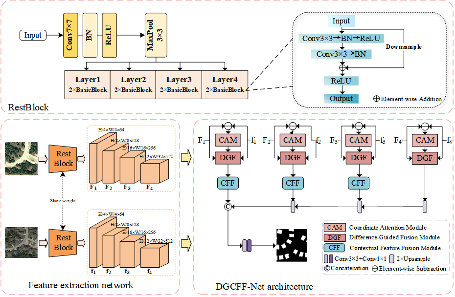

[](https://doi.org/10.5281/zenodo.19522499)
# DGCFF-Net

This repository contains the official PyTorch implementation of the paper:

**"Difference-Guided and Contextual Feature Fusion for Efficient Change Detection in Remote Sensing Imagery"**(Currently under review at The Visual Computer).

---

## 📌 Overview

DGCFF-Net is a highly efficient, lightweight deep learning architecture designed for remote sensing change detection. By balancing accuracy and computational overhead, the model achieves strong performance with only **14.65M** parameters and **11.88G FLOPs**.

**Key Algorithmic Implementations:**

* **Difference-Guided Fusion (DGF):** Explicitly models temporal variations between bi-temporal images and suppresses false positive changes via coordinate attention mechanisms.

      Implementation: rscd/models/decoderheads/DGCFFnet.py

* **Contextual Feature Fusion (CFF):** Integrates multi-scale features leveraging self-attention and channel attention, enhancing edge preservation and sensitivity to subtle changes.

      Implementation: rscd/models/decoderheads/DGCFFnet.py

## 🧠 Network Architecture


The model achieves strong performance with only **14.65M parameters** and **11.88G FLOPs**.

---

## ⚙️ Environment

* Python: 3.9
* PyTorch: 2.0.0
* CUDA: 11.7

Installation via Conda:
We highly recommend using a Conda environment to manage dependencies and ensure reproducibility.

```bash
# Create and activate the conda environment
conda create -n dgcff python=3.9 -y
conda activate dgcff

# Install PyTorch with CUDA 11.7 support
conda install pytorch==2.0.0 torchvision==0.15.0 torchaudio==2.0.0 pytorch-cuda=11.7 -c pytorch -c nvidia

# Install remaining dependencies
pip install -r requirements.txt
```

---

## 📂 Dataset

We evaluate our method on three publicly available remote sensing change detection datasets. Please follow the links below to download the raw data:
### 1. LEVIR-CD

A large-scale dataset for building change detection.
It contains 637 image pairs with a resolution of 1024×1024.

Download link: https://justchenhao.github.io/LEVIR/

---

### 2. SYSU-CD

A dataset focusing on urban change detection with diverse scenarios.

Download link: https://github.com/liumency/SYSU-CD

---

### 3. WHU-CD

A high-resolution dataset for building change detection.

Download link: http://gpcv.whu.edu.cn/data/building_dataset.html

---

## 📌 Data Preprocessing

* Images are cropped into 256×256 patches
* Data augmentation:

  * Random flipping
  * Rotation
* Standard normalization is applied
  
We follow the same data splits as previous works for fair comparison.
---

## 📁 Directory Structure

Please organize the project directory as follows:

```
DGCFF-Net/
├── rscd/                         # source code
├── work_dirs/                    # training outputs
│   └── CLCD_BS4_epoch200/
│       └── stnet/
│           └── version_0/
│               ├── ckpts/
│               │   ├── test/     # best checkpoints on test set
│               │   └── val/      # best checkpoints on validation set
│               ├── log/          # TensorBoard logs
│               ├── train_metrics.txt
│               ├── test_metrics_max.txt
│               └── test_metrics_rest.txt
└── data/
    ├── LEVIR_CD/
    │   ├── train/
    │   │   ├── A/
    │   │   ├── B/
    │   │   └── label/
    │   ├── val/
    │   └── test/
    ├── WHU_CD/
    │   ├── train/
    │   │   ├── image1/
    │   │   ├── image2/
    │   │   └── label/
    │   ├── val/
    │   └── test/
    └── SYSU_CD/
        ├── train/
        │   ├── time1/
        │   ├── time2/
        │   └── label/
        ├── val/
        └── test/
```

---

## 📌 Notes

* `rscd/` contains the implementation of DGCFF-Net
* `work_dirs/` stores model checkpoints, logs, and evaluation results
* `data/` contains all datasets organized in a unified structure

Make sure the dataset paths match the configuration files before training.


---

## 🚀 Training

To train the DGCFF-Net model from scratch, ensure your dataset paths in configs/DGCFFNet.py are correct and run:

```bash
python train.py -c configs/DGCFFNet.py
```

---

## 🔍 Testing
To evaluate a trained model, use the testing script and point it to your specific checkpoint:
```bash
python test.py -c configs/DGCFFNet.py \
  --ckpt work_dirs/CLCD_BS4_epoch200/dgcffnet/version_1/ckpts/test/test_change_f1 \
  --output_dir work_dirs/CLCD_BS4_epoch200/dgcffnet/version_1/ckpts/test \
```

---

## 📊 Reproducibility & Code Availability

The experimental results reported in the paper (e.g., 91.09% F1-score on LEVIR-CD) can be fully reproduced using the provided codebase, predefined configurations, and standardized dataset structures.

GitHub Repository: https://github.com/wangmeng49/DGCFF-Net/

---

## 📖 Citation & Acknowledgment
⚠️ Important Note: This codebase is directly related to the manuscript currently under review at The Visual Computer.

If you find this code, our architectural design, or the experimental results useful for your own research, we kindly urge you to cite our manuscript:

```bibtex
@article{dgcffnet2026,
  title={Difference-Guided and Contextual Feature Fusion for Efficient Change Detection in Remote Sensing Imagery},
  author={Anonymous},
  journal={The Visual Computer},
  year={2026}
}
